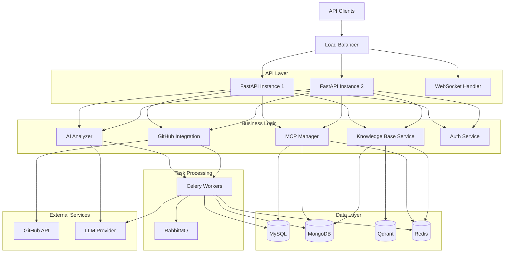

# Design Document: MCP Platform Backend

## Overview

The MCP Platform Backend is a comprehensive, production-ready system for managing Model Context Protocol (MCP) tools. Built with modern Python async patterns, it provides a scalable architecture supporting multiple database systems, AI-powered analysis, real-time communication, and dynamic service deployment.

### Key Design Principles

1. **Async-First Architecture**: Leverage FastAPI and SQLAlchemy 2.0 async capabilities for non-blocking I/O operations
2. **Separation of Concerns**: Clear boundaries between API layer, business logic, data access, and external integrations
3. **Polyglot Persistence**: Use appropriate database technologies for different data types (MySQL for structured, MongoDB for documents, Qdrant for vectors, Redis for caching)
4. **Scalability**: Horizontal scaling through stateless API servers and distributed task processing
5. **Observability**: Comprehensive logging, metrics, and health checks for production monitoring

## Architecture

### High-Level Architecture



### Technology Stack

- **API Framework**: FastAPI 0.110+ with async/await support
- **ORM**: SQLAlchemy 2.0 with asyncpg driver for PostgreSQL/MySQL
- **Document Store**: Motor (async MongoDB driver) 4.6+
- **Vector Database**: Qdrant Python client 1.7+ or ChromaDB 0.4+
- **Cache**: Redis 7.0 with aioredis client
- **Task Queue**: Celery 5.3+ with RabbitMQ 3.12+ broker
- **AI Integration**: LangChain 0.1+ for LLM orchestration
- **Authentication**: python-jose for JWT, passlib for password hashing
- **Validation**: Pydantic 2.5+ for data validation
- **Migration**: Alembic for database schema migrations
- **Monitoring**: prometheus-client for metrics export

## Components and Interfaces

### 1. API Layer

#### FastAPI Application Structure

```python
# Main application with middleware stack
app = FastAPI(
    title="MCP Platform API",
    version="1.0.0",
    docs_url="/api/docs",
    redoc_url="/api/redoc"
)

# Middleware chain (order matters)
app.add_middleware(CORSMiddleware, ...)
app.add_middleware(RequestIDMiddleware)
app.add_middleware(LoggingMiddleware)
app.add_middleware(RateLimitMiddleware)
app.add_middleware(AuthenticationMiddleware)
```

#### API Router Organization

```
/api/v1/
├── /auth          # Authentication endpoints
├── /mcps          # MCP tool CRUD operations
├── /knowledge     # Knowledge base management
├── /analyze       # AI analysis endpoints
├── /github        # GitHub integration
├── /deployments   # MCP server deployments
└── /admin         # Administrative functions

/mcp/{slug}/v1/*   # Dynamic MCP service endpoints
/metrics           # Prometheus metrics
/health            # Health check endpoint
/ws                # WebSocket endpoint
```

### 2. MCP Manager Component

**Responsibilities**:
- CRUD operations for MCP tools
- Version history management
- Deployment lifecycle management

**Interface**:
```python
class MCPManager:
    async def create_tool(self, tool_data: MCPToolCreate) -> MCPTool
    async def get_tool(self, tool_id: UUID) -> Optional[MCPTool]
    async def update_tool(self, tool_id: UUID, updates: MCPToolUpdate) -> MCPTool
    async def delete_tool(self, tool_id: UUID) -> bool
    async def list_tools(self, filters: MCPToolFilters, pagination: Pagination) -> Page[MCPTool]
    async def get_tool_history(self, tool_id: UUID) -> List[MCPToolVersion]
```

**Data Flow**:
1. API receives request with validated Pydantic model
2. Manager checks cache (Redis) for read operations
3. Manager performs database operation (MySQL for current state)
4. For updates/deletes, manager stores version in MongoDB
5. Manager invalidates relevant cache entries
6. Manager returns domain model to API layer

### 3. Knowledge Base Service

**Responsibilities**:
- Document storage and retrieval
- Vector embedding generation
- Semantic search

**Interface**:
```python
class KnowledgeBaseService:
    async def store_document(self, doc: DocumentCreate) -> Document
    async def search_documents(self, query: str, limit: int, filters: dict) -> List[SearchResult]
    async def get_document(self, doc_id: UUID) -> Optional[Document]
    async def delete_document(self, doc_id: UUID) -> bool
    async def generate_embeddings(self, text: str) -> List[float]
```

**Embedding Strategy**:
- Use LangChain's embedding abstraction for flexibility
- Default to OpenAI embeddings (text-embedding-3-small)
- Store embeddings in Qdrant with metadata filtering support
- Batch embedding generation for efficiency

**Search Flow**:
1. Convert query text to embedding vector
2. Perform similarity search in Qdrant (top-k results)
3. Fetch full documents from MongoDB using returned IDs
4. Apply post-filtering and ranking
5. Return enriched search results

### 4. AI Analyzer Component

**Responsibilities**:
- Feasibility analysis of MCP configurations
- Improvement suggestions generation
- Auto-configuration generation

**Interface**:
```python
class AIAnalyzer:
    async def analyze_feasibility(self, config: MCPConfig) -> FeasibilityReport
    async def suggest_improvements(self, tool_id: UUID) -> List[Improvement]
    async def generate_config(self, requirements: ConfigRequirements) -> MCPConfig
```

**LangChain Integration**:
```python
# Use LangChain for structured LLM interactions
from langchain.chat_models import ChatOpenAI
from langchain.prompts import ChatPromptTemplate
from langchain.output_parsers import PydanticOutputParser

class AIAnalyzer:
    def __init__(self):
        self.llm = ChatOpenAI(model="gpt-4", temperature=0.2)
        self.parser = PydanticOutputParser(pydantic_object=FeasibilityReport)
    
    async def analyze_feasibility(self, config: MCPConfig) -> FeasibilityReport:
        prompt = self._build_feasibility_prompt(config)
        response = await self.llm.ainvoke(prompt)
        return self.parser.parse(response.content)
```

**Async Task Delegation**:
- Analysis tasks > 30s are queued to Celery
- Return task ID immediately to client
- Client polls /tasks/{task_id} or subscribes via WebSocket
- Results stored in Redis with TTL

### 5. GitHub Integration Component

**Responsibilities**:
- Repository connection management
- Content synchronization
- Webhook processing

**Interface**:
```python
class GitHubIntegration:
    async def connect_repository(self, repo_url: str, token: str) -> GitHubConnection
    async def sync_repository(self, connection_id: UUID) -> SyncResult
    async def disconnect_repository(self, connection_id: UUID) -> bool
    async def process_webhook(self, event: GitHubWebhookEvent) -> None
```

**Sync Strategy**:
- Use PyGithub for GitHub API interactions
- Sync operations run as Celery tasks
- Store repository metadata in MySQL
- Store file contents in MongoDB
- Detect changes using commit SHA comparison

### 6. MCP Server Manager

**Responsibilities**:
- Dynamic MCP server lifecycle management
- Request routing to deployed servers
- Health monitoring

**Interface**:
```python
class MCPServerManager:
    async def deploy_server(self, tool_id: UUID, config: DeploymentConfig) -> Deployment
    async def stop_server(self, deployment_id: UUID) -> bool
    async def route_request(self, slug: str, request: Request) -> Response
    async def check_health(self, deployment_id: UUID) -> HealthStatus
```

**Deployment Architecture**:
- Each MCP tool deployed as separate process/container
- Use subprocess management for local deployments
- Use Docker API for containerized deployments
- Reverse proxy pattern for request routing
- Health checks every 30 seconds

### 7. Authentication Service

**Responsibilities**:
- User authentication (JWT + OAuth2)
- API key management
- Role-based access control

**Interface**:
```python
class AuthService:
    async def authenticate_user(self, username: str, password: str) -> Optional[User]
    async def create_access_token(self, user: User) -> str
    async def verify_token(self, token: str) -> Optional[TokenPayload]
    async def verify_api_key(self, api_key: str) -> Optional[User]
    async def check_permission(self, user: User, resource: str, action: str) -> bool
```

**JWT Strategy**:
- Access tokens: 15 minute expiry
- Refresh tokens: 7 day expiry, stored in Redis
- Token payload includes user_id, roles, permissions
- Use RS256 algorithm for production

**RBAC Model**:
```python
# Roles: admin, developer, viewer
# Permissions: create, read, update, delete
# Resources: mcps, knowledge, deployments, users

ROLE_PERMISSIONS = {
    "admin": ["*:*"],
    "developer": ["mcps:*", "knowledge:*", "deployments:read"],
    "viewer": ["mcps:read", "knowledge:read"]
}
```

## Data Models

### MySQL Schema (Structured Data)

```sql
-- MCP Tools table
CREATE TABLE mcp_tools (
    id CHAR(36) PRIMARY KEY,
    name VARCHAR(255) NOT NULL,
    slug VARCHAR(255) UNIQUE NOT NULL,
    description TEXT,
    version VARCHAR(50) NOT NULL,
    author_id CHAR(36) NOT NULL,
    status ENUM('draft', 'active', 'deprecated') DEFAULT 'draft',
    created_at TIMESTAMP DEFAULT CURRENT_TIMESTAMP,
    updated_at TIMESTAMP DEFAULT CURRENT_TIMESTAMP ON UPDATE CURRENT_TIMESTAMP,
    deleted_at TIMESTAMP NULL,
    INDEX idx_slug (slug),
    INDEX idx_author (author_id),
    INDEX idx_status (status)
);

-- MCP Deployments table
CREATE TABLE mcp_deployments (
    id CHAR(36) PRIMARY KEY,
    tool_id CHAR(36) NOT NULL,
    endpoint_url VARCHAR(512) NOT NULL,
    status ENUM('starting', 'running', 'stopped', 'failed') DEFAULT 'starting',
    health_status ENUM('healthy', 'unhealthy', 'unknown') DEFAULT 'unknown',
    last_health_check TIMESTAMP NULL,
    deployed_at TIMESTAMP DEFAULT CURRENT_TIMESTAMP,
    stopped_at TIMESTAMP NULL,
    FOREIGN KEY (tool_id) REFERENCES mcp_tools(id),
    INDEX idx_tool (tool_id),
    INDEX idx_status (status)
);

-- Usage Statistics table
CREATE TABLE mcp_usage_stats (
    id BIGINT AUTO_INCREMENT PRIMARY KEY,
    tool_id CHAR(36) NOT NULL,
    deployment_id CHAR(36),
    endpoint VARCHAR(255) NOT NULL,
    method VARCHAR(10) NOT NULL,
    status_code INT NOT NULL,
    response_time_ms INT NOT NULL,
    user_id CHAR(36),
    timestamp TIMESTAMP DEFAULT CURRENT_TIMESTAMP,
    FOREIGN KEY (tool_id) REFERENCES mcp_tools(id),
    INDEX idx_tool_timestamp (tool_id, timestamp),
    INDEX idx_deployment (deployment_id)
);

-- Users table
CREATE TABLE users (
    id CHAR(36) PRIMARY KEY,
    username VARCHAR(100) UNIQUE NOT NULL,
    email VARCHAR(255) UNIQUE NOT NULL,
    password_hash VARCHAR(255) NOT NULL,
    role ENUM('admin', 'developer', 'viewer') DEFAULT 'viewer',
    is_active BOOLEAN DEFAULT TRUE,
    created_at TIMESTAMP DEFAULT CURRENT_TIMESTAMP,
    updated_at TIMESTAMP DEFAULT CURRENT_TIMESTAMP ON UPDATE CURRENT_TIMESTAMP,
    INDEX idx_username (username),
    INDEX idx_email (email)
);

-- API Keys table
CREATE TABLE api_keys (
    id CHAR(36) PRIMARY KEY,
    user_id CHAR(36) NOT NULL,
    key_hash VARCHAR(255) NOT NULL,
    name VARCHAR(100) NOT NULL,
    last_used_at TIMESTAMP NULL,
    expires_at TIMESTAMP NULL,
    created_at TIMESTAMP DEFAULT CURRENT_TIMESTAMP,
    revoked_at TIMESTAMP NULL,
    FOREIGN KEY (user_id) REFERENCES users(id),
    INDEX idx_user (user_id)
);

-- GitHub Connections table
CREATE TABLE github_connections (
    id CHAR(36) PRIMARY KEY,
    user_id CHAR(36) NOT NULL,
    tool_id CHAR(36),
    repository_url VARCHAR(512) NOT NULL,
    last_sync_sha VARCHAR(40),
    last_sync_at TIMESTAMP NULL,
    created_at TIMESTAMP DEFAULT CURRENT_TIMESTAMP,
    FOREIGN KEY (user_id) REFERENCES users(id),
    FOREIGN KEY (tool_id) REFERENCES mcp_tools(id),
    INDEX idx_tool (tool_id)
);
```

### SQLAlchemy Models

```python
from sqlalchemy import Column, String, Text, Enum, TIMESTAMP, Integer, Boolean, ForeignKey
from sqlalchemy.dialects.mysql import CHAR
from sqlalchemy.orm import relationship
from datetime import datetime
import enum

class ToolStatus(str, enum.Enum):
    DRAFT = "draft"
    ACTIVE = "active"
    DEPRECATED = "deprecated"

class MCPToolModel(Base):
    __tablename__ = "mcp_tools"
    
    id = Column(CHAR(36), primary_key=True)
    name = Column(String(255), nullable=False)
    slug = Column(String(255), unique=True, nullable=False, index=True)
    description = Column(Text)
    version = Column(String(50), nullable=False)
    author_id = Column(CHAR(36), nullable=False, index=True)
    status = Column(Enum(ToolStatus), default=ToolStatus.DRAFT, index=True)
    created_at = Column(TIMESTAMP, default=datetime.utcnow)
    updated_at = Column(TIMESTAMP, default=datetime.utcnow, onupdate=datetime.utcnow)
    deleted_at = Column(TIMESTAMP, nullable=True)
    
    # Relationships
    deployments = relationship("MCPDeploymentModel", back_populates="tool")
    usage_stats = relationship("MCPUsageStatModel", back_populates="tool")
```

### MongoDB Collections (Document Data)

```javascript
// mcp_config_history collection
{
  _id: ObjectId,
  tool_id: UUID,
  version: String,
  config: {
    // Full MCP configuration object
    servers: [...],
    tools: [...],
    prompts: [...]
  },
  changed_by: UUID,
  changed_at: ISODate,
  change_type: "create" | "update" | "delete",
  diff: Object  // JSON diff from previous version
}

// knowledge_base collection
{
  _id: ObjectId,
  document_id: UUID,
  title: String,
  content: String,
  metadata: {
    source: String,
    author: String,
    tags: [String],
    language: String
  },
  embedding_id: UUID,  // Reference to vector DB
  created_at: ISODate,
  updated_at: ISODate
}

// task_results collection
{
  _id: ObjectId,
  task_id: UUID,
  task_type: String,
  status: "pending" | "running" | "completed" | "failed",
  result: Object,
  error: String,
  created_at: ISODate,
  completed_at: ISODate,
  ttl_expires_at: ISODate  // TTL index for auto-deletion
}
```

### Pydantic Models (API Schemas)

```python
from pydantic import BaseModel, Field, ConfigDict
from typing import Optional, List
from datetime import datetime
from uuid import UUID

# Request/Response models
class MCPToolCreate(BaseModel):
    name: str = Field(..., min_length=1, max_length=255)
    slug: str = Field(..., pattern=r'^[a-z0-9-]+$')
    description: Optional[str] = None
    version: str = Field(..., pattern=r'^\d+\.\d+\.\d+$')
    config: dict = Field(..., description="MCP configuration object")

class MCPToolUpdate(BaseModel):
    name: Optional[str] = Field(None, min_length=1, max_length=255)
    description: Optional[str] = None
    version: Optional[str] = Field(None, pattern=r'^\d+\.\d+\.\d+$')
    config: Optional[dict] = None
    status: Optional[ToolStatus] = None

class MCPTool(BaseModel):
    model_config = ConfigDict(from_attributes=True)
    
    id: UUID
    name: str
    slug: str
    description: Optional[str]
    version: str
    author_id: UUID
    status: ToolStatus
    created_at: datetime
    updated_at: datetime

class DocumentCreate(BaseModel):
    title: str = Field(..., min_length=1, max_length=500)
    content: str = Field(..., min_length=1)
    metadata: dict = Field(default_factory=dict)

class SearchResult(BaseModel):
    document_id: UUID
    title: str
    content_snippet: str
    similarity_score: float
    metadata: dict

class FeasibilityReport(BaseModel):
    score: float = Field(..., ge=0.0, le=1.0)
    is_feasible: bool
    reasoning: str
    risks: List[str]
    recommendations: List[str]
```

### Vector Database Schema (Qdrant)

```python
# Collection configuration
collection_config = {
    "vectors": {
        "size": 1536,  # OpenAI embedding dimension
        "distance": "Cosine"
    },
    "payload_schema": {
        "document_id": "uuid",
        "title": "text",
        "source": "keyword",
        "tags": "keyword[]",
        "created_at": "datetime"
    }
}

# Point structure
{
    "id": UUID,
    "vector": [float] * 1536,
    "payload": {
        "document_id": UUID,
        "title": str,
        "source": str,
        "tags": List[str],
        "created_at": datetime
    }
}
```

### Redis Data Structures

```python
# Cache keys pattern
"cache:mcp_tool:{tool_id}" -> JSON serialized MCPTool
"cache:mcp_tools:list:{hash}" -> JSON serialized list results
"cache:document:{doc_id}" -> JSON serialized Document

# Session keys
"session:{session_id}" -> JSON user session data (TTL: 7 days)

# Refresh tokens
"refresh_token:{token_hash}" -> user_id (TTL: 7 days)

# Task status
"task:{task_id}:status" -> "pending" | "running" | "completed" | "failed"
"task:{task_id}:result" -> JSON result (TTL: 1 hour)

# Rate limiting
"ratelimit:{user_id}:{endpoint}" -> counter (TTL: 1 minute)
```

## Correctness Properties

*A property is a characteristic or behavior that should hold true across all valid executions of a system—essentially, a formal statement about what the system should do. Properties serve as the bridge between human-readable specifications and machine-verifiable correctness guarantees.*


### Property 1: MCP Tool Creation Persistence
*For any* valid MCP tool metadata, when a tool is created, the tool should be retrievable from MySQL using the returned identifier and contain equivalent data.
**Validates: Requirements 1.1, 1.2**

### Property 2: Version History on Update
*For any* MCP tool and any valid update, after updating the tool, MySQL should contain the new state and MongoDB should contain a history record with the previous version.
**Validates: Requirements 1.3**

### Property 3: Soft Delete Preservation
*For any* MCP tool, when deleted, the tool should have a non-null deleted_at timestamp in MySQL and MongoDB should contain a deletion history record.
**Validates: Requirements 1.4**

### Property 4: Pagination Invariants
*For any* pagination parameters (page, page_size), the returned results should not exceed page_size, and the total count should equal the sum of all pages.
**Validates: Requirements 1.5**

### Property 5: Dual-Store Document Consistency
*For any* document uploaded, both MongoDB and Vector_DB should contain corresponding records with matching document_id.
**Validates: Requirements 2.1**

### Property 6: Search Result Ordering
*For any* semantic search query, the returned results should be ordered by descending similarity score.
**Validates: Requirements 2.2**

### Property 7: Document Deletion Consistency
*For any* document, when deleted, the document should be removed from both MongoDB and Vector_DB.
**Validates: Requirements 2.4**

### Property 8: Embedding Dimension Consistency
*For any* set of documents in the knowledge base, all embeddings should have the same vector dimension.
**Validates: Requirements 2.5**

### Property 9: AI Analysis Response Completeness
*For any* MCP configuration submitted for feasibility analysis, the response should contain a score (0.0-1.0) and non-empty reasoning text.
**Validates: Requirements 3.1**

### Property 10: Improvement Suggestions Non-Empty
*For any* tool submitted for improvement analysis, the response should contain at least one recommendation.
**Validates: Requirements 3.2**

### Property 11: Generated Configuration Validity
*For any* configuration requirements, the auto-generated MCP configuration should pass Pydantic schema validation.
**Validates: Requirements 3.3**

### Property 12: Analysis Result Persistence
*For any* completed AI analysis task, MongoDB should contain a result document with matching task_id.
**Validates: Requirements 3.5**

### Property 13: GitHub Connection Validation
*For any* valid repository URL and access token, connecting should create a record in the github_connections table.
**Validates: Requirements 4.1**

### Property 14: Repository Sync Consistency
*For any* connected GitHub repository, after syncing, the tool configuration should match the repository's current state.
**Validates: Requirements 4.2**

### Property 15: GitHub Disconnect Preservation
*For any* GitHub connection, when disconnected, the connection record should be removed but the associated tool data should remain in mcp_tools table.
**Validates: Requirements 4.4**

### Property 16: Webhook Async Processing
*For any* GitHub webhook event, the event should be queued as a Celery task for asynchronous processing.
**Validates: Requirements 4.5**

### Property 17: Deployment Endpoint Uniqueness
*For any* set of active MCP deployments, all endpoint URLs should be unique.
**Validates: Requirements 5.1**

### Property 18: Request Routing Correctness
*For any* HTTP request to a deployed MCP tool endpoint, the request should be routed to the handler for the correct tool based on the slug.
**Validates: Requirements 5.2**

### Property 19: Deployment Shutdown Status
*For any* running MCP deployment, when stopped, the deployment status should transition to "stopped" in the database.
**Validates: Requirements 5.5**

### Property 20: JWT Token Claims Completeness
*For any* valid user authentication, the generated JWT token should contain claims for user_id and roles.
**Validates: Requirements 6.1**

### Property 21: JWT Token Round-Trip Validation
*For any* JWT token generated by the system, the token should validate successfully and return the original user_id within the expiry period.
**Validates: Requirements 6.2**

### Property 22: Expired Token Rejection
*For any* JWT token past its expiry time, accessing protected endpoints should return HTTP 401 status.
**Validates: Requirements 6.3**

### Property 23: Authorization Permission Check
*For any* user and action beyond their role permissions, the request should be rejected with HTTP 403 status.
**Validates: Requirements 6.4**

### Property 24: API Key Authentication
*For any* valid API key, authentication should succeed and return the associated user.
**Validates: Requirements 6.5**

### Property 25: State Persistence in MySQL
*For any* MCP tool modification (create, update, delete), the current state should be reflected in the MySQL mcp_tools table.
**Validates: Requirements 7.1, 7.3**

### Property 26: Configuration History Append
*For any* MCP tool configuration change, the MongoDB mcp_config_history collection should grow by exactly one document.
**Validates: Requirements 7.2**

### Property 27: Usage Statistics Recording
*For any* API request to an MCP tool endpoint, a usage statistics record should be created in MySQL with a timestamp.
**Validates: Requirements 7.4**

### Property 28: Version History Retrieval
*For any* MCP tool with configuration changes, retrieving version history should return all historical versions in chronological order.
**Validates: Requirements 7.5**

### Property 29: Cache Hit on Repeated Access
*For any* MCP tool, when requested twice in succession without modifications, the second request should be served from Redis cache.
**Validates: Requirements 8.1**

### Property 30: Cache Invalidation on Update
*For any* MCP tool, after updating the tool, subsequent requests should return the updated data (cache should be invalidated).
**Validates: Requirements 8.2**

### Property 31: Session Storage with TTL
*For any* user session created, Redis should contain the session data with an expiry time set.
**Validates: Requirements 8.3**

### Property 32: Cache Fallback on Failure
*For any* MCP tool request, when Redis is unavailable, the request should still succeed by querying MySQL directly.
**Validates: Requirements 8.4**

### Property 33: Async Task Queuing
*For any* long-running operation (AI analysis, GitHub sync, embedding generation), a Celery task should be created and queued.
**Validates: Requirements 9.1, 9.2, 9.3**

### Property 34: Task Status Update on Completion
*For any* Celery task, when completed, the task status in Redis should be updated to "completed" with the result.
**Validates: Requirements 9.4**

### Property 35: Input Validation Rejection
*For any* API request with invalid payload data, the response should be HTTP 422 with detailed validation errors.
**Validates: Requirements 10.2, 11.1**

### Property 36: Validation Error Detail
*For any* request validation failure, the error response should contain field-level error information identifying which fields failed validation.
**Validates: Requirements 10.3**

### Property 37: Response Schema Consistency
*For any* API endpoint, all successful responses should conform to the documented Pydantic response schema.
**Validates: Requirements 10.4**

### Property 38: API Version Routing
*For any* versioned API endpoint (e.g., /api/v1/*, /api/v2/*), requests should be routed to the correct version handler.
**Validates: Requirements 10.5**

### Property 39: Rate Limit Enforcement
*For any* user, when the rate limit is exceeded for an endpoint, subsequent requests should return HTTP 429 status.
**Validates: Requirements 11.2**

### Property 40: Sensitive Data Redaction
*For any* log entry containing sensitive data (passwords, tokens, API keys), the sensitive values should be redacted or masked.
**Validates: Requirements 11.4**

### Property 41: CORS Origin Validation
*For any* CORS request from a non-whitelisted origin, the request should be rejected or the CORS headers should not be set.
**Validates: Requirements 11.5**

### Property 42: Structured Error Logging
*For any* error that occurs during request processing, a structured log entry should be created containing error type, message, and context.
**Validates: Requirements 12.2**

### Property 43: Request Correlation ID
*For any* API request, the request and response logs should contain the same correlation ID for traceability.
**Validates: Requirements 12.4**

### Property 44: WebSocket Authentication
*For any* WebSocket connection attempt, the connection should only be established after successful authentication.
**Validates: Requirements 13.1**

### Property 45: WebSocket Status Push
*For any* task status change, all WebSocket clients subscribed to that task should receive a status update message.
**Validates: Requirements 13.2**

### Property 46: SSE Event Delivery
*For any* server-sent event, all clients subscribed to the event stream should receive the event.
**Validates: Requirements 13.3**

### Property 47: Connection Cleanup
*For any* WebSocket or SSE connection that is closed, the associated resources (memory, subscriptions) should be released.
**Validates: Requirements 13.4**

### Property 48: Broadcast Message Delivery
*For any* broadcast message sent, all currently connected WebSocket clients should receive the message.
**Validates: Requirements 13.5**

### Property 49: Environment Configuration Loading
*For any* environment variable defined in the configuration schema, the application should load and use the value from the environment.
**Validates: Requirements 14.2**

### Property 50: Invalid Configuration Rejection
*For any* invalid configuration (missing required fields, wrong types), the application should fail to start with a clear error message.
**Validates: Requirements 14.5**

### Property 51: Migration Execution Order
*For any* set of Alembic migrations, when applied, they should execute in dependency order based on revision numbers.
**Validates: Requirements 15.2**

### Property 52: Migration Rollback on Failure
*For any* migration that fails during execution, the database should be rolled back to the state before the migration started.
**Validates: Requirements 15.3**

### Property 53: Migration Downgrade Support
*For any* applied migration, running the downgrade should successfully revert the schema changes.
**Validates: Requirements 15.5**

## Error Handling

### Error Handling Strategy

The platform implements a layered error handling approach:

1. **Validation Layer**: Pydantic models catch invalid input at API boundary
2. **Business Logic Layer**: Custom exceptions for domain-specific errors
3. **Data Layer**: Database-specific error handling and retries
4. **Global Handler**: Catch-all for unexpected errors

### Exception Hierarchy

```python
class MCPPlatformException(Exception):
    """Base exception for all platform errors"""
    def __init__(self, message: str, code: str, details: dict = None):
        self.message = message
        self.code = code
        self.details = details or {}
        super().__init__(self.message)

class ValidationError(MCPPlatformException):
    """Raised when data validation fails"""
    pass

class NotFoundError(MCPPlatformException):
    """Raised when requested resource doesn't exist"""
    pass

class AuthenticationError(MCPPlatformException):
    """Raised when authentication fails"""
    pass

class AuthorizationError(MCPPlatformException):
    """Raised when user lacks permissions"""
    pass

class ExternalServiceError(MCPPlatformException):
    """Raised when external service (GitHub, LLM) fails"""
    pass

class DatabaseError(MCPPlatformException):
    """Raised when database operation fails"""
    pass
```

### Error Response Format

All errors return consistent JSON structure:

```json
{
  "error": {
    "code": "RESOURCE_NOT_FOUND",
    "message": "MCP tool with ID 'abc-123' not found",
    "details": {
      "resource_type": "mcp_tool",
      "resource_id": "abc-123"
    },
    "timestamp": "2024-12-29T10:30:00Z",
    "request_id": "req_xyz789"
  }
}
```

### HTTP Status Code Mapping

- 400 Bad Request: ValidationError
- 401 Unauthorized: AuthenticationError
- 403 Forbidden: AuthorizationError
- 404 Not Found: NotFoundError
- 422 Unprocessable Entity: Pydantic ValidationError
- 429 Too Many Requests: Rate limit exceeded
- 500 Internal Server Error: Unexpected errors
- 502 Bad Gateway: ExternalServiceError
- 503 Service Unavailable: Database connection failures

### Retry Strategy

```python
# Database operations: exponential backoff
@retry(
    stop=stop_after_attempt(3),
    wait=wait_exponential(multiplier=1, min=1, max=10),
    retry=retry_if_exception_type(DatabaseError)
)
async def database_operation():
    pass

# External API calls: exponential backoff with jitter
@retry(
    stop=stop_after_attempt(5),
    wait=wait_exponential_jitter(initial=1, max=60),
    retry=retry_if_exception_type(ExternalServiceError)
)
async def external_api_call():
    pass

# Celery tasks: automatic retry with countdown
@celery_app.task(bind=True, max_retries=3)
def async_task(self):
    try:
        # Task logic
        pass
    except Exception as exc:
        raise self.retry(exc=exc, countdown=60 * (2 ** self.request.retries))
```

### Circuit Breaker Pattern

For external services (GitHub, LLM providers):

```python
from circuitbreaker import circuit

@circuit(failure_threshold=5, recovery_timeout=60)
async def call_github_api():
    # GitHub API call
    pass

@circuit(failure_threshold=3, recovery_timeout=120)
async def call_llm_api():
    # LLM API call
    pass
```

### Graceful Degradation

- **Cache Failure**: Fall back to direct database queries
- **Vector DB Failure**: Return empty search results with warning
- **LLM Failure**: Queue analysis for retry, return task ID
- **GitHub API Failure**: Store sync request for later retry

## Testing Strategy

### Dual Testing Approach

The platform requires both unit tests and property-based tests for comprehensive coverage:

- **Unit Tests**: Verify specific examples, edge cases, and error conditions
- **Property Tests**: Verify universal properties across all inputs

Both testing approaches are complementary and necessary. Unit tests catch concrete bugs in specific scenarios, while property tests verify general correctness across a wide range of inputs.

### Property-Based Testing Configuration

**Framework**: Use Hypothesis for Python property-based testing

**Configuration**:
- Minimum 100 iterations per property test (due to randomization)
- Each property test must reference its design document property
- Tag format: `# Feature: mcp-platform-backend, Property {number}: {property_text}`

**Example Property Test**:

```python
from hypothesis import given, strategies as st
import pytest

# Feature: mcp-platform-backend, Property 1: MCP Tool Creation Persistence
@given(
    name=st.text(min_size=1, max_size=255),
    slug=st.from_regex(r'^[a-z0-9-]+$', fullmatch=True),
    version=st.from_regex(r'^\d+\.\d+\.\d+$', fullmatch=True)
)
@pytest.mark.asyncio
async def test_mcp_tool_creation_persistence(name, slug, version):
    """For any valid MCP tool metadata, created tool should be retrievable"""
    # Create tool
    tool_data = MCPToolCreate(name=name, slug=slug, version=version, config={})
    created_tool = await mcp_manager.create_tool(tool_data)
    
    # Retrieve tool
    retrieved_tool = await mcp_manager.get_tool(created_tool.id)
    
    # Assert equivalence
    assert retrieved_tool is not None
    assert retrieved_tool.name == name
    assert retrieved_tool.slug == slug
    assert retrieved_tool.version == version
```

### Unit Testing Strategy

**Framework**: pytest with pytest-asyncio for async tests

**Coverage Areas**:
- API endpoint integration tests
- Business logic edge cases
- Error condition handling
- Authentication and authorization flows
- Database transaction handling

**Example Unit Test**:

```python
@pytest.mark.asyncio
async def test_create_tool_with_duplicate_slug_fails():
    """Creating tool with duplicate slug should raise ValidationError"""
    tool_data = MCPToolCreate(
        name="Test Tool",
        slug="test-tool",
        version="1.0.0",
        config={}
    )
    
    # Create first tool
    await mcp_manager.create_tool(tool_data)
    
    # Attempt to create duplicate
    with pytest.raises(ValidationError) as exc_info:
        await mcp_manager.create_tool(tool_data)
    
    assert "slug already exists" in str(exc_info.value).lower()
```

### Test Organization

```
tests/
├── unit/
│   ├── api/
│   │   ├── test_mcp_endpoints.py
│   │   ├── test_knowledge_endpoints.py
│   │   └── test_auth_endpoints.py
│   ├── services/
│   │   ├── test_mcp_manager.py
│   │   ├── test_knowledge_service.py
│   │   └── test_ai_analyzer.py
│   └── models/
│       ├── test_pydantic_models.py
│       └── test_sqlalchemy_models.py
├── property/
│   ├── test_mcp_properties.py
│   ├── test_knowledge_properties.py
│   ├── test_auth_properties.py
│   └── test_cache_properties.py
├── integration/
│   ├── test_end_to_end_flows.py
│   ├── test_github_integration.py
│   └── test_celery_tasks.py
└── conftest.py  # Shared fixtures
```

### Test Fixtures

```python
# conftest.py
import pytest
from sqlalchemy.ext.asyncio import create_async_engine, AsyncSession
from motor.motor_asyncio import AsyncIOMotorClient

@pytest.fixture
async def db_session():
    """Provide test database session"""
    engine = create_async_engine("sqlite+aiosqlite:///:memory:")
    async with AsyncSession(engine) as session:
        yield session

@pytest.fixture
async def mongo_client():
    """Provide test MongoDB client"""
    client = AsyncIOMotorClient("mongodb://localhost:27017/test")
    yield client
    await client.drop_database("test")

@pytest.fixture
async def redis_client():
    """Provide test Redis client"""
    redis = await aioredis.create_redis_pool("redis://localhost:6379/15")
    yield redis
    await redis.flushdb()
    redis.close()
    await redis.wait_closed()

@pytest.fixture
def mcp_manager(db_session, mongo_client, redis_client):
    """Provide MCPManager instance with test dependencies"""
    return MCPManager(
        db_session=db_session,
        mongo_client=mongo_client,
        cache=redis_client
    )
```

### Continuous Integration

- Run all tests on every pull request
- Require 80% code coverage minimum
- Run property tests with 100 iterations in CI
- Run extended property tests (1000 iterations) nightly
- Integration tests run against Docker Compose environment

### Performance Testing

- Load testing with Locust for API endpoints
- Benchmark database query performance
- Monitor memory usage during long-running tasks
- Test WebSocket connection limits

## Deployment Architecture

### Container Structure

```yaml
# docker-compose.yml structure
services:
  api:          # FastAPI application (multiple replicas)
  worker:       # Celery worker (multiple replicas)
  beat:         # Celery beat scheduler
  mysql:        # MySQL database
  mongodb:      # MongoDB database
  qdrant:       # Qdrant vector database
  redis:        # Redis cache
  rabbitmq:     # RabbitMQ message broker
  nginx:        # Reverse proxy and load balancer
  prometheus:   # Metrics collection
  grafana:      # Metrics visualization
```

### Environment Configuration

```python
# config.py
from pydantic_settings import BaseSettings

class Settings(BaseSettings):
    # Application
    APP_NAME: str = "MCP Platform"
    APP_VERSION: str = "1.0.0"
    DEBUG: bool = False
    
    # API
    API_HOST: str = "0.0.0.0"
    API_PORT: int = 8000
    API_WORKERS: int = 4
    
    # Database
    MYSQL_HOST: str
    MYSQL_PORT: int = 3306
    MYSQL_USER: str
    MYSQL_PASSWORD: str
    MYSQL_DATABASE: str
    
    MONGODB_URI: str
    MONGODB_DATABASE: str
    
    QDRANT_HOST: str
    QDRANT_PORT: int = 6333
    
    REDIS_URL: str
    
    # Message Broker
    RABBITMQ_URL: str
    
    # Security
    JWT_SECRET_KEY: str
    JWT_ALGORITHM: str = "RS256"
    JWT_ACCESS_TOKEN_EXPIRE_MINUTES: int = 15
    JWT_REFRESH_TOKEN_EXPIRE_DAYS: int = 7
    
    # External Services
    GITHUB_CLIENT_ID: str
    GITHUB_CLIENT_SECRET: str
    
    OPENAI_API_KEY: str
    
    # Monitoring
    PROMETHEUS_ENABLED: bool = True
    LOG_LEVEL: str = "INFO"
    
    class Config:
        env_file = ".env"
        case_sensitive = True

settings = Settings()
```

### Health Check Implementation

```python
from fastapi import APIRouter, status
from typing import Dict

router = APIRouter()

@router.get("/health", status_code=status.HTTP_200_OK)
async def health_check() -> Dict[str, str]:
    """
    Health check endpoint for load balancers and orchestrators.
    Verifies all critical dependencies are accessible.
    """
    checks = {
        "mysql": await check_mysql(),
        "mongodb": await check_mongodb(),
        "redis": await check_redis(),
        "qdrant": await check_qdrant(),
        "rabbitmq": await check_rabbitmq()
    }
    
    if all(checks.values()):
        return {"status": "healthy", "checks": checks}
    else:
        raise HTTPException(
            status_code=status.HTTP_503_SERVICE_UNAVAILABLE,
            detail={"status": "unhealthy", "checks": checks}
        )
```

### Monitoring and Observability

**Prometheus Metrics**:
```python
from prometheus_client import Counter, Histogram, Gauge

# Request metrics
http_requests_total = Counter(
    'http_requests_total',
    'Total HTTP requests',
    ['method', 'endpoint', 'status']
)

http_request_duration_seconds = Histogram(
    'http_request_duration_seconds',
    'HTTP request duration',
    ['method', 'endpoint']
)

# Business metrics
mcp_tools_total = Gauge('mcp_tools_total', 'Total MCP tools')
active_deployments = Gauge('active_deployments', 'Active MCP deployments')
cache_hit_rate = Gauge('cache_hit_rate', 'Cache hit rate')

# Task metrics
celery_tasks_total = Counter(
    'celery_tasks_total',
    'Total Celery tasks',
    ['task_name', 'status']
)
```

**Structured Logging**:
```python
import structlog

logger = structlog.get_logger()

# Log with context
logger.info(
    "mcp_tool_created",
    tool_id=str(tool.id),
    tool_name=tool.name,
    author_id=str(tool.author_id),
    request_id=request_id
)
```

## Security Considerations

### Authentication Flow

1. User submits credentials to `/api/v1/auth/login`
2. Server validates credentials against database
3. Server generates JWT access token (15 min) and refresh token (7 days)
4. Refresh token stored in Redis with user_id mapping
5. Client includes access token in Authorization header
6. Server validates token on each request
7. Client uses refresh token to obtain new access token when expired

### Authorization Model

```python
# Decorator for permission checking
def require_permission(resource: str, action: str):
    def decorator(func):
        @wraps(func)
        async def wrapper(*args, **kwargs):
            user = get_current_user()
            if not await auth_service.check_permission(user, resource, action):
                raise AuthorizationError(
                    f"User lacks permission: {resource}:{action}"
                )
            return await func(*args, **kwargs)
        return wrapper
    return decorator

# Usage
@router.post("/api/v1/mcps")
@require_permission("mcps", "create")
async def create_mcp_tool(tool_data: MCPToolCreate):
    pass
```

### Input Sanitization

- All user input validated by Pydantic models
- SQL injection prevented by SQLAlchemy ORM
- NoSQL injection prevented by Motor's query builders
- XSS prevention through output encoding
- File upload validation (type, size, content)

### Rate Limiting

```python
from slowapi import Limiter
from slowapi.util import get_remote_address

limiter = Limiter(key_func=get_remote_address)

@router.post("/api/v1/mcps")
@limiter.limit("10/minute")
async def create_mcp_tool():
    pass
```

### Secrets Management

- Use environment variables for secrets
- Never commit secrets to version control
- Use secret management services (AWS Secrets Manager, HashiCorp Vault)
- Rotate secrets regularly
- Use different secrets per environment

## References

Content was rephrased for compliance with licensing restrictions.

- [FastAPI async SQLAlchemy best practices](https://leapcell.io/blog/building-high-performance-async-apis-with-fastapi-sqlalchemy-2-0-and-asyncpg)
- [Celery FastAPI integration patterns](https://medium.com/@tomtalksit/integrating-fastapi-with-celery-for-background-task-processing-27a81ecffffc)
- [LangChain Qdrant integration](https://python.langchain.com/docs/integrations/vectorstores/qdrant/)
- [Hypothesis property-based testing documentation](https://hypothesis.readthedocs.io/)
